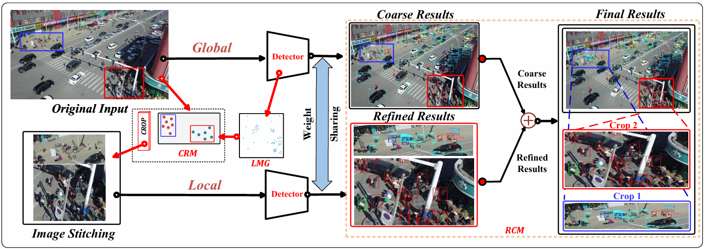

L-CENTERNET: A LOCALIZATION-BASED APPROACH 
FOR AERIAL TINY OBJECT DETECTION
=========================================

Requirement
============
This repo is implemented based on mmdetection. 

- Python >= 3.8
- PyTorch >= 1.7.0
- mmdetection == 2.26.0 (>=2.17.0, <3.0.0)
- kornia == 0.6.9

Checkpoint
====================
We provide L-CenterNet's checkpoint file. Please download model weights at the link.

Data preparation
=================
Use gen_crop.py to generate VisDrone train dataset. You can directly use annotations/VisDrone2019-DET_val_coco.json for its val dataset.

python gen_crop.py

Train
===============

- Training on a single GPU
  
python train.py configs/L-CenterNet.py

- Training on multiple GPUs

./dist_train.sh configs/L-CenterNet.py <your_gpu_num>

Eval
==========

- set saved_crop to 0,1,2,3 corresponding to CRM (k=saved_crop)

python eval.py

